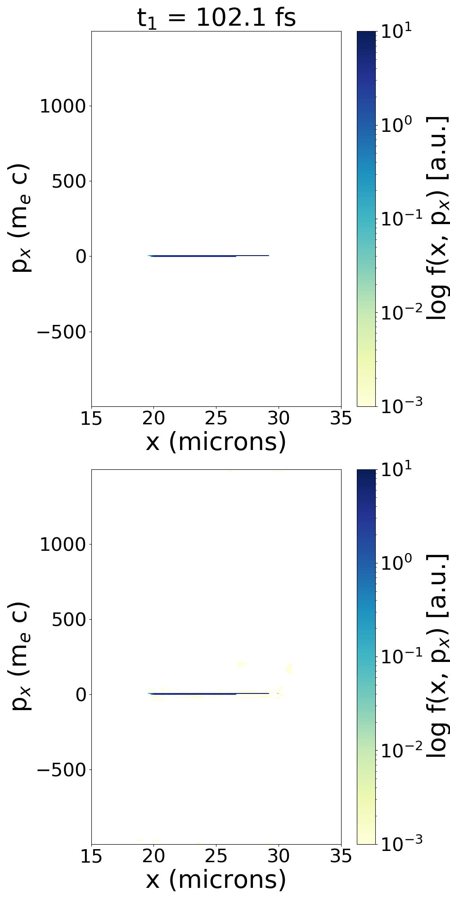

# Neural Operator for parameterized 1D TNSA simulations

<p float="left" align="center"> 

</p>

## How to run
```python fcno.py```

```python fno-baseline.py```

```python fno-cnn.py```

```python fno-ff.py```

```python fno-mlp.py```

```python fno-reg.py```

All models use FNO framework that can be found here:
```
https://github.com/zongyi-li/fourier_neural_operator.git
```
Plots for all test data for each method can be found in ```plots``` folder
